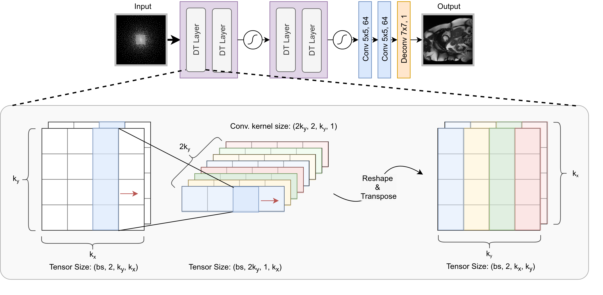
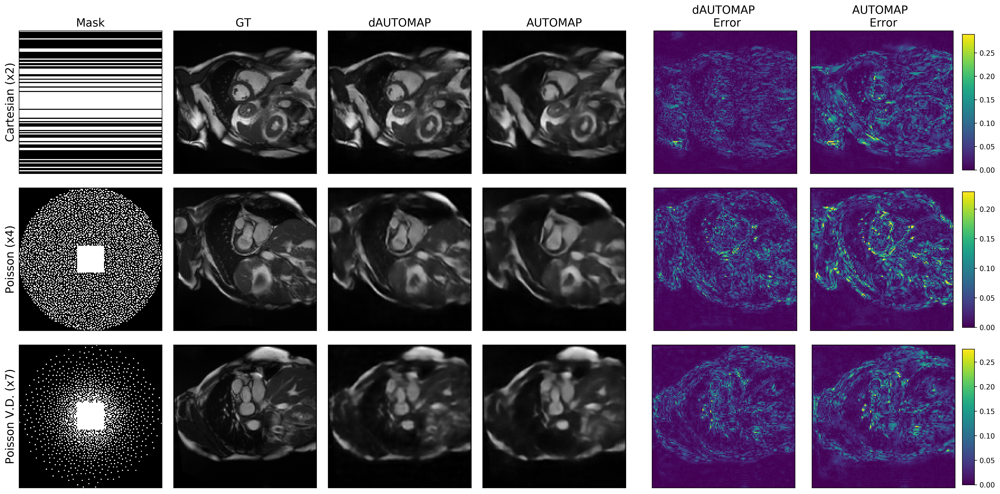
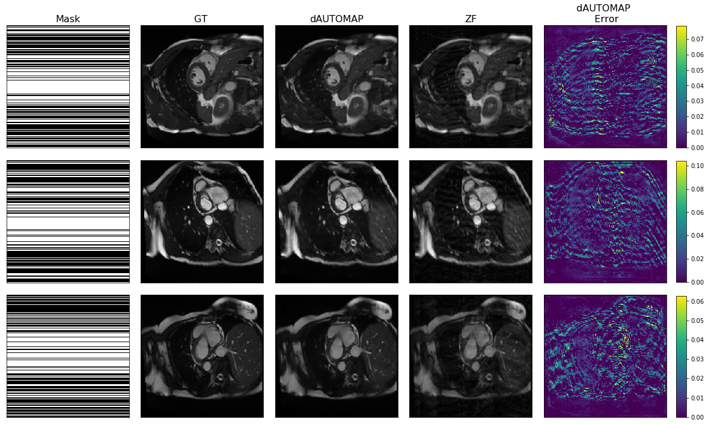
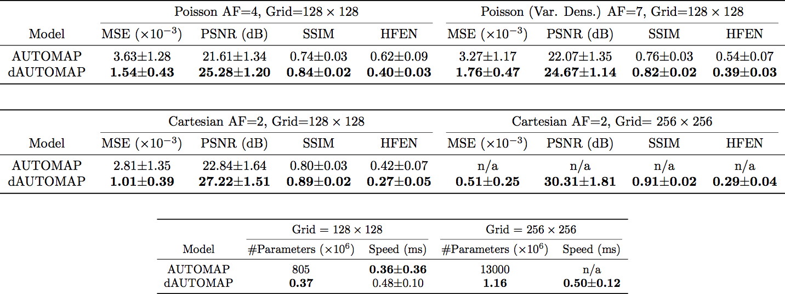

# dAUTOMAP

dAUTOMAP: Decomposing AUTOMAP to Achieve Scalability and Enhance Performance

Authors: Jo Schlemper, Ilkay Oksuz, James Clough, Jinming Duan, Andrew King, Julia Schnabel, Joseph Hajnal, Daniel Rueckert

AUTOMAP is a promising generalized reconstruction approach, however, it is not scalable and hence the practicality is limited. We present a novel way for decomposing the domain transformation, which makes the model scale linearly with the input size. We show the proposed method, termed dAUTOMAP, outperforms AUTOMAP with significantly fewer parameters.

The abstract was presented as an oral presentation during the Scientific Session: "Machine Learning for Image Reconstruction" at ISMRM2019 (https://www.ismrm.org/19/program_files/O49.htm).

This repository contains the code for dAUTOMAP.

Qualitative results for the synthetic experiments with image size 128x128

Qualitative results for the synthetic experiments with image size 256x256, 2x Cartesian reconstruction

Quantitative Results:

